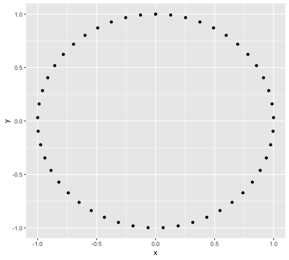
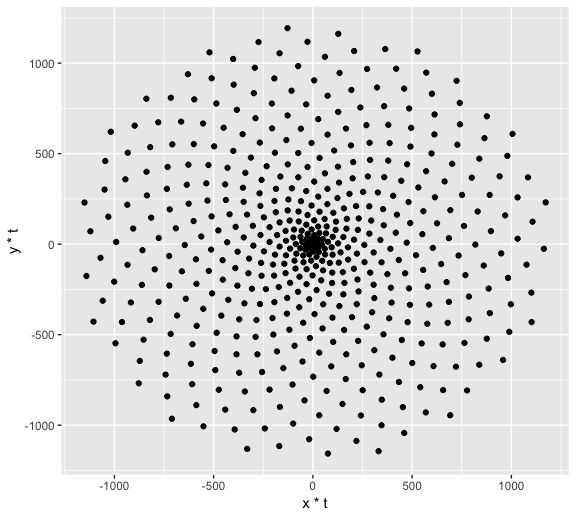

A flower in the wild
================
Amin Yakubu
12/23/2018

Let's start by drawing 50 points on a circle of radius 1. As every (x, y) point should be in the unit circle, it follows that x² + y² = 1.We can get this using the Pythagorean trigonometric identity which states that sin²(θ) + cos²(θ) = 1 for any real number θ.

Remember, circumference of a circle is C=2πr

``` r
t <- seq(0, 2*pi, length.out = 50)
x <- sin(t)
y <- cos(t)
df <- data.frame(t, x, y)

# Make a scatter plot of points in a circle
p <- ggplot(df, aes(x, y))
p + geom_point()
```



### Golden Angle

Plants arrange their leaves in spirals. A spiral is a curve which starts from the origin and moves away from this point as it revolves around it. In the plot above all our points are at the same distance from the origin. A simple way to arrange them in a spiral is to multiply x and y by a factor which increases for each point. We could use t as that factor, as it meets these conditions, but we will do something more harmonious. We will use the Golden Angle:

Golden Angle = π(3 − √5)

This number is inspired by the Golden Ratio, one of the most famous numbers in the history of mathematics. Both the Golden Ratio and the Golden Angle appear in unexpected places in nature. Apart of flower petals and plant leaves, you'll find them in seed heads, pine cones, sunflower seeds, shells, spiral galaxies, hurricanes, etc.

``` r
# Defining the number of points
points = 500

# Defining the Golden Angle
angle = pi * (3 - sqrt(5))

t <- (1:points) * angle
x <- sin(t)
y <- cos(t)
df <- data.frame(t, x, y)

# Make a scatter plot of points in a spiral
p <- ggplot(df, aes(x*t, y*t))
p + geom_point()
```


